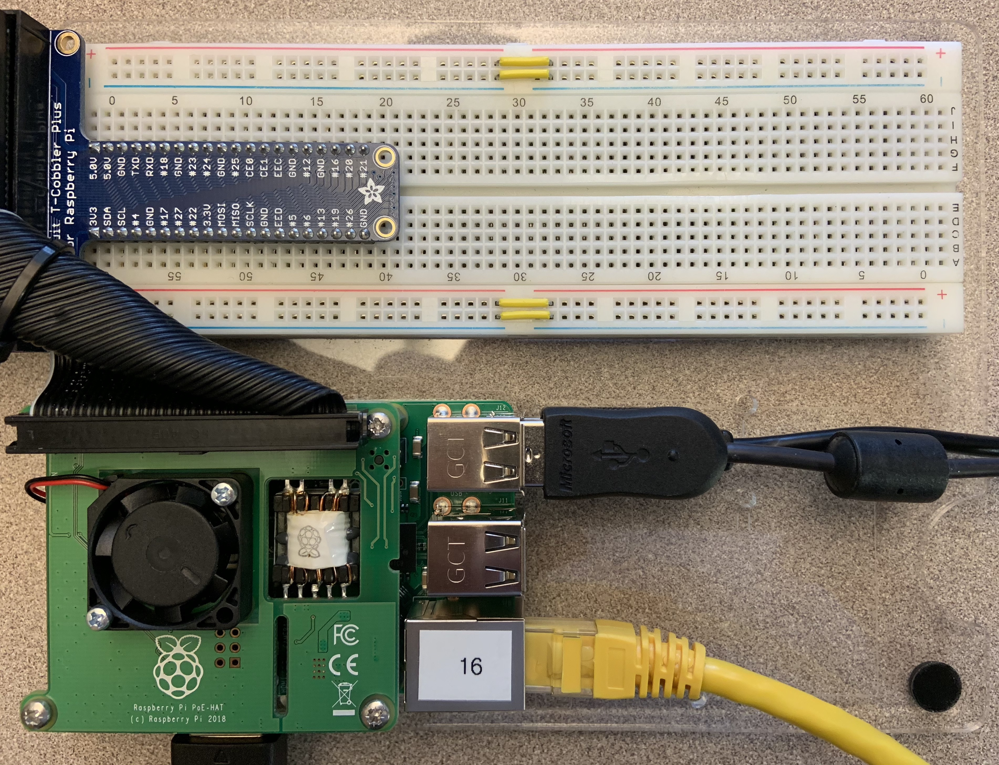

+++
draft = false
title = "About Python"
Weight = 1
+++

In this lab we are going to introduce the Python programming language that we are going to use to program our Raspberry Pi projects.

# Raspberry Pi
The Raspberry Pi (RPi) is a credit card-sized computer that is relatively low cost, and has been used for a wide variety of projects.  Many people have used RPis to be their media centre, and nearly as many have developed game consoles, which run emulators of old gaming systems and arcade machines (e.g. Sega Genesis, Atari 2600, Nintendo 64).  There are many other projects.

The RPi runs a Linux distribution called Raspbian.  Raspbian is a scaled down version of Debian Linux, built for the ARM architecture and including some useful packages.  In most cases the operating system (OS) is loaded from the microSD card, but in the lab we load the OS over the network.

# Python programming language
Python is a simple to learn yet powerful programming language that was conceived in the late 1980s and nowadays is a widely used programming language backed with a huge community. There are hundreds of modules that can be used for free for almost anything you might need to do. And YES, you can write and run python in the Raspberry Pi, and there are modules that allow us to interact with the GPIO ports, the camera, etc.

## Hardware Setup

To get started, obtain a Raspberry Pi kit.  The contents of the RPi kit include an RPi, an Ethernet cable, a multimeter, and various wires and components.

The most important component is the RPi itself.  Remove it from its Mylar bag and set it down carefully on a flat surface.  Note that it has been mounted onto a plastic mounting board along with a breadboard.

We will use this breadboard in future labs, but not this time.  To start, we'll need keyboard, mouse, network, and display connections.  Start by plugging in an HDMI cable.  Ensure the monitor is on.


{{}}


Next, plug in the network cable into the RPi and one of the ethernet ports in the lab.  The RPi is powered over the network.  Wait for the boot screen to appear on the monitor (approximately 30s after plugging in the network cable) before plugging in the keyboard and mouse.  This is a bug in the RPi's firmware.


In the UA 2460 lab the RPi will **not** boot if the keyboard is plugged in first.  You **must** unplug the keyboard before booting the RPi.  To restart the RPi, remove the network cable and plug it back in.


After a short time (~60s), the RPi will boot to a graphical login screen.  Log into the RPi using your science.uoit.ca username and password.


Your username is your student/banner ID.  Your password is your student/banner ID, followed by an underscore.


e.g.

Banner ID | Username  | Password
--------- | --------- | --------
100000001 | 100000001 | 100000001_
100000002 | 100000002 | 100000002_

Once logged in, take a few minutes to examine some of the applications available in the menu (which is accessible from the top left corner, similar to the start menu in Windows).

In the menu, navigate to Programming -> Python 3 (IDLE) to start the Python development environment.

## Running Python on the Raspberry Pi
IDLE is a relatively simple IDE for Python.  It doesn't have the capabilities of Visual Studio, but it will do for our purposes.  When you see:

```python
>>> 
```

This is the interactive Python shell.  It is a place where you can enter Python code directly, and have it execute immediately.  At the Python shell, type in the following (don't type the prompt):

```python
>>> 2 + 9
```

Sometimes, this interactive mode is what you want and sometimes you want to edit a program in a file.  Let's create a program in a file.  In the 'File' menu, choose 'New Window' to open a text editor.  In the window that appears, type in the following test program:

```python
print("testing 1 2 3...")
```

Choose 'File', 'Save As' and save this file in ~/Documents with the name basics.py.  Hit F5 to run your program, and you should see the output 'testing 1 2 3...' in the first IDLE window.  Spend a few minutes familiarizing yourself with the menu in the IDLE windows.  It has common text editor functionality, along with some basic programming environment features (e.g. Comment Out Region).

## Python Language Introduction
In this part of the lab, we'll experiment with some Python language features, under the assumption that you have previously written programs in C++.  First of all, let's consider variables and values.  In the Python shell, type in the following:

```python
>>> x = 8
>>> print(x)
8
>>> print(x * 2)
16
```

Notice that the results of the program were printed after each line?  Now, type in the following code into the text editor window:

```python
x = 8
print(x)
print(x * 2)
```

Save this program over your basics.py program from part 2 and execute it with <kbd>F5</kbd>.  Notice that this program does not execute line-by-line, but executes the entire program when you hit <kbd>F5</kbd>.

Let's add some other variables to the end of our program:

```python
name = "Raspberry Pi"
length = 14.5
width = 7.25
```

Represented in our program are three different value types: integer, floating point, and string.  Let's print some values.  Add the following code to the end of the program:

```python
print("x: ")
print(x)
print("Name:", name)
print("width:",)
print(width)
print("length:" + str(length))
```

Save and run the program.  Notice what happened?  In some cases, spaces were added automatically by print, and in other cases a newline was added.  You'll need to be careful about that if you want precise output in Python.  To suppress the spaces, follow the pattern for length above.  To suppress the newline, add the extra comma on the right side, like with the following line:

```python
print("width:",)
```

Now, let's try out conditionals.

```python
x = 8
if x < 10:
    print("x is small")
elif X < 20:
    print("x is medium")
else:
    print("x is large")
```

Try experimenting with different values for X until you understand how the conditional works.


Python uses whitespace to structure code blocks.  In C++, you surrounded your code block in `{` and `}`, but in Python you _indent_ your code block.  Be sure to be consistent with your spacing or you might confuse Python if code is inside or outside of a block.  Avoid mixing spaces and tabs.


Let's examine a while loop now.  Again, the major difference with C++ is the use of indentation to show what code is inside the loop.

```python
x = 8
while x > 0:
    print(x)
    x = x - 1
```

In Python, for loops work using lists so let's examine those in more detail before we learn the for loop syntax.  A list is merely a collection of elements of the same type surrounded by square brackets (e.g. `[1, 2, 3, 4, 5]`).  We can loop over any list:

```python
names = ["Bob", "Sally", "Kunal", "Ahmed", "Carla"]
for name in names:
    print(name)
```

There is a function `range()` that can generate a list, that is very useful in for loops.  You can pass 3 values to range:  the minimum, the maximum, and the step size, and `range()` will generate a list that starts at the minimum value (default 0), proceeds to the next by adding the step size (default 1), until the maximum value is reached.  The maximum value is not included in the resulting list.  Try out `range()` a bit in the Python shell:
	
```python
>>> list(range(10))
>>> list(range(5, 10))
>>> list(range(5, 15, 2))
```

We are finally ready to use a familiar form of for loop:

```python
for val in range(0, 20):
    print(val)
```

There is a lot more to Python, but this should be enough to get us through these labs.
