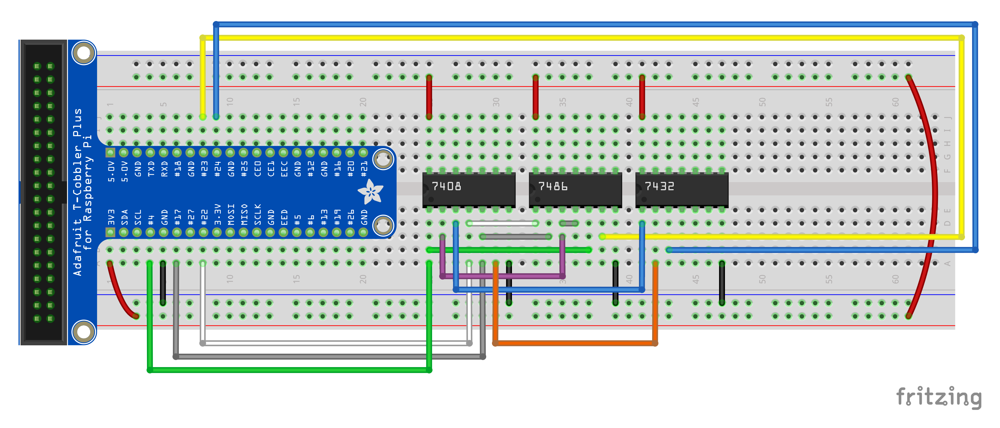

+++
draft = false
title = "Creating Circuits on the Breadboard - Part 2"
Weight = 5
+++

## Full Adders

A full adder is a circuit that adds two binary digits, plus a carry in, producing a sum and a carry out bit.  The carry bit is one (high) when the three bits add up to more than can be stored in a single digit.  This happens when two or more of the input bits is one (high).

### Circuit Design

The same process used for the half adder can be used to design the circuit for a full adder, starting with the truth table (which is filled out by hand, based on what we know about the behaviour of the circuit).


A | B | Carry in | Sum | Carry out
-------|-------|-------|-------|-------
0 | 0 | 0 | 0 | 0
0 | 0 | 1 | 1 | 0
0 | 1 | 0 | 1 | 0
0 | 1 | 1 | 0 | 1
1 | 0 | 0 | 1 | 0
1 | 0 | 1 | 0 | 1
1 | 1 | 0 | 0 | 1
1 | 1 | 1 | 1 | 1


Using a Karnaugh map, and knowledge of XOR, we can get simplified Boolean algebraic expressions for each of the two output variables.

$$\begin{align*}S &= A \oplus B \oplus C\_{in} \\\\ C\_{out} &= ((A \oplus B) \land C\_{in}) \lor (A \land B)\end{align*}$$

The circuit corresponding to these Boolean algebraic expressions is shown below.


{{}}


### Hardware Setup

In addition to the components from the half adder, we'll need to add a 7432 chip for the single OR gate that is shown in the circuit diagram.  Connect power and ground to this chip accordingly.  Connect the gate inputs and outputs according to the following table:

Gate  | Input 1 | Input 2 | Output
------|---------|---------|-------
XOR 1 | A (GPIO22) | B (GPIO17) | XOR 2 input 1
XOR 2 | XOR 1 output | Cin (GPIO4) | S (GPIO23)
AND 1 | Cin (GPIO4) | XOR 1 output | OR input 1
AND 2 | A (GPIO22) | B (GPIO17) | OR input 2
OR    | AND 1 output | AND 2 output | Cout (GPIO24)

The resulting circuit should look something like the following illustration.


{{}}


## Exercise

Write some code in Python to test your full adder circuit will all possible inputs.  Use the `half_adder_test.py` as a starting point.
