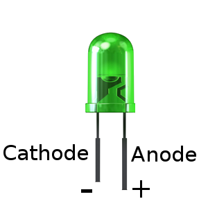
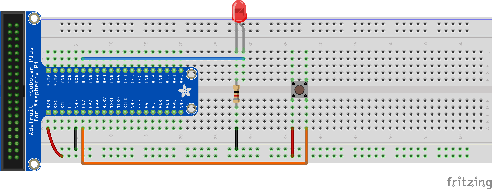

+++
draft = false
title = "Raspberry Pi GPIO"
Weight = 2
+++

In this lab we are going to introduce the GPIO interface of the Raspberry Pi.

## What is GPIO?

In one corner of the Raspberry Pi is a 40-pin expansion header.  The pins are numbered from 1 to 40, with the even numbers on the outside edge of the board as shown below.

 [CC BY-SA 2.0], via Wikimedia Commons](https://commons.wikimedia.org/wiki/File:Raspberry_Pi_3_B%2B_(39906369025).png)")

Each of these GPIO pins are identified below.

")

There are several different types of pins in the expansion header.

<dl>
  <dt>Light Red</dt>
  <dd>Connected to the Pi's 5V rail, provides a consistent +5.0V.</dd>
  <dt>Dark Red</dt>
  <dd>Connected to the Pi's 3.3V rail, provides a consistent +3.3V.</dd>
  <dt>Black</dt>
  <dd>Connected to the Pi's ground, provides a consistent 0V.</dd>
  <dt>Yellow <small>New in Model B+</small></dt>
  <dd>I2C bus dedicated to expansion boards</dd>
</dl>

All the remaining pins are known as the **General-purpose input/output (GPIO)**.  The GPIO is a generic pin on a circuit whose behaviour, including whether it is an input or output, may be controlled by the user at run-time.

The GPIO pins are connected to the +3.3V rails.  When used for input they are able to read voltages.  When used for output they may be set to +3.3V (high) or 0V (low).

There are 4 different types of GPIO pins on the Raspberry Pi.  Of these, three may be used as GPIO or special purposes.

<dl>
  <dt>Green</dt>
  <dd>These are generic GPIO pins without a special purpose.</dd>
  <dt>Blue</dt>
  <dd>These pins may operate as GPIO or used as an I2C bus.</dd>
  <dt>Orange</dt>
  <dd>These pins may operate as GPIO or used for <abbr title="Universal asynchronous receiver/transmitter">UART</abbr>.</dd>
  <dt>Purple</dt>
  <dd>These pins may operate as GPIO or used as an <abbr title="Serial Peripheral Interface">SPI</abbr> bus.</dd>
</dl>

In total there are 24 GPIO ports.  Although any GPIO pins may be used, when possible the green pins should be used first.


Only the first 26 pins are used for these labs.


## Using the GPIO Pins From Python

The examples below use the RPi.GPIO Python package.  It comes pre-installed in Raspbian.

To use the GPIO interface from Python the first step is to import the Raspberry Pi GPIO module.


import RPi.GPIO as GPIO


Then it is necessary to initialize the GPIO interface.


GPIO.setmode(GPIO.BOARD)


Now we are ready to start using the GPIO pins.  You may declare each pin as input (`GPIO.IN`) or output (`GPIO.OUT`), define your logic, etc.

It is good practice to clean-up when you are finished using the GPIO pins.  This resets all of the pins to their original state.


GPIO.cleanup()


### Controlling GPIO Pins

To set a GPIO pin to output mode from Python, you must set it to `GPIO.OUT`.


GPIO.setup(12, GPIO.OUT)


The pin is now set to output.  You may set it to +3.3V (high)


GPIO.output(12, GPIO.HIGH)


or 0V (low)


GPIO.output(12, GPIO.LOW)


## Example 1:  Controlling an LED

A **light-emitting diode (LED)** is a two-lead semiconductor that emits light.  It resembles a simple p-n junction diode, which emits light when activated

As LEDs are diodes, current only flows in one direction.  Thus you must connect the anode to the power source and the cathode to the ground.  Reversing these connections will not permit current to flow through and thus it will not emit light.

In general the longest leg of the LED is the anode, while the shortest is the cathode.  The flat side of the LED lens is always the cathode.

To control an LED from the Pi we are going to connect it to a GPIO pin.  While any GPIO pin may be used, this example uses pin #12.  As you can verify in the pinout diagram above, this corresponds to the GPIO #18 (as labelled in the header).



As the output voltage of the GPIO pins is +3.3V and the LED only uses +2.1V, we must add a resistor.  The specification of this LED says it consumes 20mA.  Each pin supplies up to 16mA, so the actual forward current consumed by the LED is 16mA, not 20mA.

To calculate the appropriate resistor value we must use Ohm's law as follows.

$$
  R = \frac{V}{I} = \frac{3.3\text{V} - 2.1\text{V}}{16\text{mA}} = \frac{1.2\text{V}}{0.016\text{A}} = 75\Omega
$$

As the formula indicates, we need a resistor value of at least 75&#8486;, so a resistor value of 82&#8486; is suitable.

With the circuit constructed, we may now control the LED with the Raspberry Pi.

The following code initializes the GPIO, sets pin #12 to output, turns the LED on, sleeps for 3 seconds, then finally turns the LED off.


import RPi.GPIO as GPIO
import time

GPIO.setmode(GPIO.BOARD)
GPIO.setup(12, GPIO.OUT)

GPIO.output(12, GPIO.HIGH)

time.sleep(3)

GPIO.output(12, GPIO.LOW)

GPIO.cleanup()


### Reading Input

Similarly to how we defined a GPIO output pin, we may define a GPIO input pin.


GPIO.setup(11, GPIO.IN, pull_up_down=GPIO.PUD_DOWN)


Notice the extra argument `pull_up_down` provided to the setup function.  The purpose of this argument will be explained later.

In order to read a value from this pin, we use the `input` method.  This returns either `GPIO.HIGH` or `GPIO.LOW`, depending on if the input is considered active or not.


GPIO.input(11)


When an input pin is considered active depends on the value passed to the `pull_up_down` argument.  There are two possible values.

* `GPIO.PUD_DOWN` - The input is considered active if it is receiving +3.3V, inactive otherwise.
* `GPIO.PUD_UP` - The input is considered active if reading less than +3.3V, inactive if it reads +3.3V.

The table below further clarifies the difference between these two values.  The value +1.8V is there for illustrative purposes and does not have special meaning.

Value           | +3.3V    | < +3.3V  | 0V
----------------|----------|----------|---------
`GPIO.PUD_DOWN` | Active   | Inactive | Inactive
`GPIO.PUD_UP`   | Inactive | Active   | Active

The same effect could be produced by using an actual resistor before (PUD_UP) or after (PUD_DOWN) the button in the circuit, but you can also take advantage of the fact that the Raspberry Pi's GPIO pins have pull down and pull up resistors.

## Example 2:  Button Input

### Simple button input with the Raspberry Pi.

In our previous example we demonstrated the usage of a GPIO pin as output.  In order to demonstrate using a GPIO pin for input, we are going to extend the previous example to make the LED blink when a button is pressed.

Start with the circuit from Example 1.  Insert a momentary pushbutton switch into the breadboard.  Connect one terminal to pin #11 (which corresponds to GPIO#17) and another to +3.3V.

Your circuit should be similar to the following.

When the button is pressed, the circuit between the +3.3V pin and pin #11 is completed.  This causes the input value of #11 to be `GPIO.HIGH`.  As we want a value of `GPIO.HIGH` to be read when the button has been pressed, we use set the `pull_up_down` argument to `GPIO.PUD_DOWN`.

The following Python program turns on the LED when the button is pressed.  The LED is turned off otherwise.


import RPi.GPIO as GPIO

GPIO.setmode(GPIO.BOARD)

GPIO.setup(12, GPIO.OUT)
GPIO.setup(11, GPIO.IN, pull_up_down=GPIO.PUD_DOWN)
GPIO.output(12, GPIO.LOW)

try:
    while True:
        GPIO.output(12, GPIO.input(11))
except KeyboardInterrupt:
    GPIO.cleanup()


## Exercise

Extend the first program to make the LED blink constantly.
