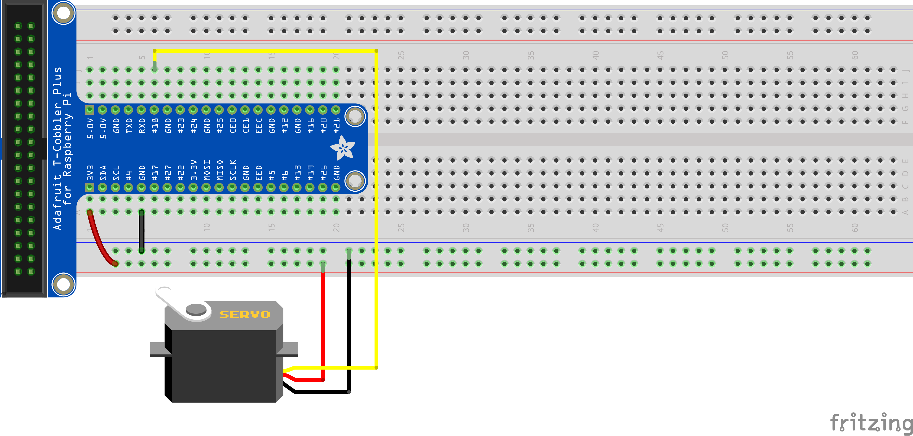

+++
draft = false
title = "Controlling a Servo from the Raspberry Pi"
Weight = 7
+++

A *Servomotor*, or servo, is a small device that has an output shaft. This shaft can be positioned to specific angular positions by sending the servo a coded signal. As long as the coded signal exists on the input line, the servo will maintain the angular position of the shaft. As the coded signal changes, the angular position of the shaft changes.

{{}}

Servos are extremely useful in practice.  They may be used to operate remote-controlled toy cars, robots, or airplanes.  Servos are also used in industrial applications, robotics, in-line manufacturing, pharmaceutics, and food services.

# How is a Servo Controlled?
Servos are controlled by sending an electrical pulse of variable width, or pulse width modulation (PWM), through the control wire. There is a minimum pulse, a maximum pulse, and a repetition rate. A servo motor can usually only turn 90 degrees in either direction for a total of 180 degree movement. The motor's neutral position is defined as the position where the servo has the same amount of potential rotation in the both the clockwise or counter-clockwise direction. The PWM sent to the motor determines position of the shaft, and based on the duration of the pulse sent via the control wire; the rotor will turn to the desired position. The servo motor expects to see a pulse every 20 milliseconds (ms) and the length of the pulse will determine how far the motor turns. For example, a 1.5ms pulse will make the motor turn to the 90-degree position. Shorter than 1.5ms moves it to 0 degrees, and any longer than 1.5ms will turn the servo to 180 degrees, as diagrammed below:


{{}}


When these servos are commanded to move, they will move to the position and hold that position. If an external force pushes against the servo while the servo is holding a position, the servo will resist from moving out of that position. The maximum amount of force the servo can exert is called the torque rating of the servo. Servos will not hold their position forever though; the position pulse must be repeated to instruct the servo to stay in position.

# Controlling a servo from the Raspberry Pi

To control the servo motor from the Raspberry Pi we are going to use the PWM module in RPi.GPIO. The first step is to create the PWM instance associated with the GPIO pin:


p = GPIO.PWM(18, 50)


In the above case we have instantiated the PWM module for the GPIO18 with a frequency of 50Hz. That frequency was selected because the servo motor expect a pulse every 20ms (period), that means 50 pulses per second or Hertz. Once instantiated the PWM module, to start sending a pulse we do:


p.start(dc)


In this case dc is the *duty cycle*. The duty cycle describes the proportion of *on* time to the regular interval or *period* of time. If we want a pulse with an specific length we can calculate the duty cycle as follows: 

$$
\text{dc} = \frac{\text{length}}{\text{period}}
$$

Since the servo uses 20ms cycles, we can calculate the duty cycle of the 3 turns of the servo motor:

$$\begin{align}
\text{dc} &= \frac{0.5}{20} \times 100 = 2.5\\% \\\\
\text{dc} &= \frac{1.5}{20} \times 100 = 7.5\\% \\\\
\text{dc} &= \frac{2.5}{20} \times 100 = 12.5\\% 
\end{align}$$

To change the duty cycle we can use:


p.ChangeDutyCycle(dc)


and to stop the pulse emission:


p.stop()


# Example of controlling a servo from the Raspberry Pi
The following diagram shows how to connect the servo to the Raspberry Pi:

{{}}

The following program will control the servo making it move to its neutral position (90 degrees), wait 1 second and then move to its 0 degrees, wait 1 second and finally move to its 180 degrees. The cycle continues until interrupted:


import RPi.GPIO as GPIO
import time

GPIO.setmode(GPIO.BCM)

GPIO.setup(18, GPIO.OUT)

p = GPIO.PWM(18, 50)

p.start(7.5)

try:
    while True:
        p.ChangeDutyCycle(7.5)  # turn towards 90 degree
        time.sleep(1) # sleep 1 second
        p.ChangeDutyCycle(2.5)  # turn towards 0 degree
        time.sleep(1) # sleep 1 second
        p.ChangeDutyCycle(12.5) # turn towards 180 degree
        time.sleep(1) # sleep 1 second 
except KeyboardInterrupt:
    p.stop()
    GPIO.cleanup()



The servo is being powered by a lower voltage than it's rated for.  While it works, it will be slower than usual.


## Exercise
Add two buttons to the circuit and extend the above program to control the servo in the following way: One button will make the servo turn to its 0 degrees, the other will make it turn to its 180 degrees and both buttons at the same time will make the servo turn towards it neutral position (90 degrees).
