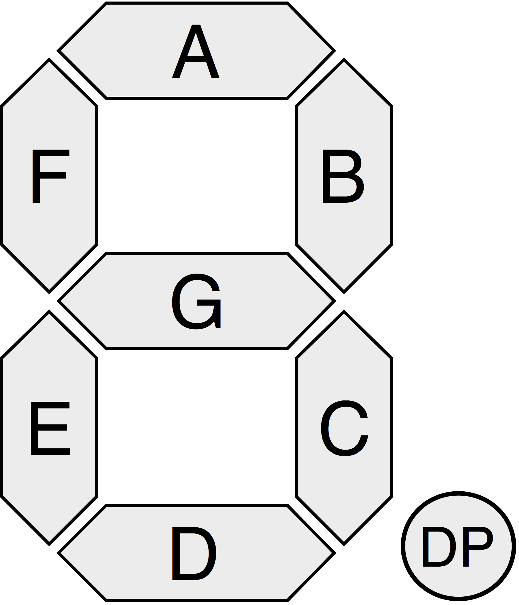
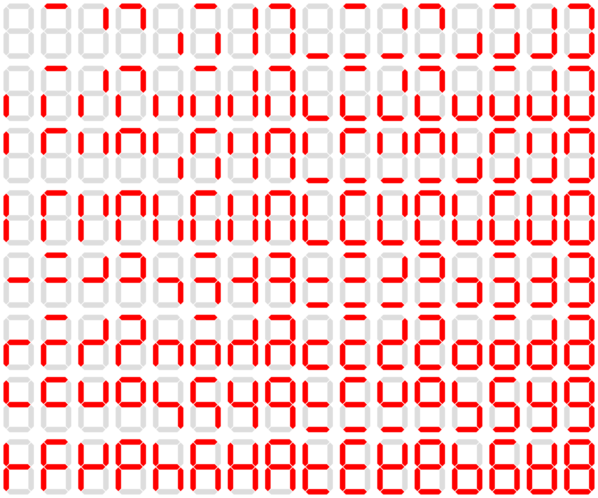
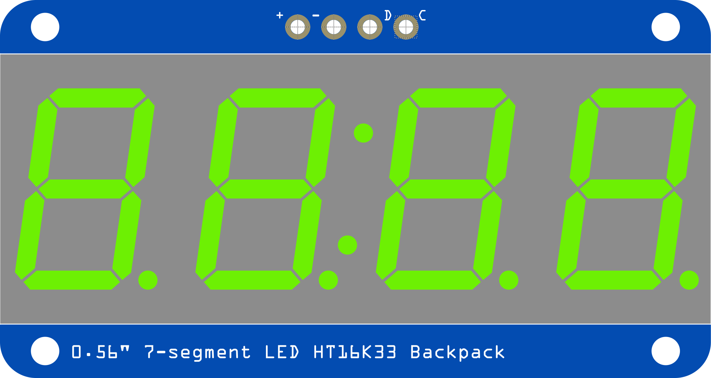
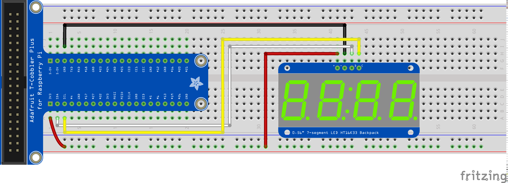

+++
draft = false
title = "Controlling a seven-segment display from the Raspberry Pi - Part 1"
Weight = 8
+++

A *seven-segment display* (SSD), is a form of electronic display device for displaying decimal numerals. They are widely used in digital clocks, electronic meters, and other electronic devices for displaying numerical information.

The seven elements of the display can be lit in different combinations to represent the Arabic numerals. The seven segments are arranged as a rectangle of two vertical segments on each side with one horizontal segment on the top, middle, and bottom. Additionally, the seventh segment bisects the rectangle horizontally. The segments of a 7-segment display are referred to by the letters A to G, where the optional DP decimal point (an *eighth segment*) is used for the display of non-integer numbers.


{{}}


There are 128 different ouput that can be generated with a 7-segment display:


{{}}


## The I2C bus

The HT16K33 7-segment display uses the I2C bus.  An I2C bus can support up to 256 different devices (e.g. sensors, motors, outputs) at the same time.  Each component has a unique hexadecimal address.  The HT16K33 generally uses a `0x70` address, but we'll verify that later.  The I2C bus uses only two GPIO pins:


Line | Purpose
-----|--------
SDA  | Data
SCL  | Clock


## Digits

All the 10 decimal digits (and all 16 hexadecimal digits) can be represented in a 7-segment display:


Digit | Input
------|------
0|0x3F
1|0x06
2|0x5B
3|0x4F
4|0x66
5|0x6D
6|0x7D
7|0x07
8|0x7F
9|0x6F
A|0x77
B|0x7C
C|0x39
D|0x5E
E|0x79
F|0x71


# Controlling the 4-digit 7-segment display

The four-digit seven-segment display that we are going to use has 4 pins (+, -, D, C).  The table below describes each pin, as well as how it should be connected to the Raspberry Pi:


{{}}



7-Segment Pin | Purpose | GPIO Pin
--------------|---------|---------
+|Power|3.3V
-|Ground|GND
D|SDA (Data for I2C)|SDA
C|SCL (Clock for I2C)|SCL


## Download the support code

Adafruit, who makes the 7-segment display, has created a Python library for our display, which provides the `segments` class.  The library is preinstalled on the Pi, but you'll need to download the example code from GitHub.


git clone https://github.com/adafruit/Adafruit_CircuitPython_HT16K33
cd Adafruit_CircuitPython_HT16K33


## Connections

First we are going to connect the four-digit seven-segment display to the GPIO pins as follows:

{{}}

## Testing connections

Let's run the provided test program, which shows the current time on the 7 segment display, to be sure it is working properly.


python examples/ht16k33_segments_7x4customchars.py


To verify that the address of our seven segment display is `0x70`, try the following command in the terminal:


i2cdetect -y 1


## Test program

Once connected as in the above diagram, you can test if everything was properly connected using the following program. This program displays 'AbCd':


# Import all board pins.
import board
import busio

# Import the HT16K33 LED segment module.
from adafruit_ht16k33 import segments

# Create the I2C interface.
i2c = busio.I2C(board.SCL, board.SDA)

# Create the LED segment class.
# This creates a 7 segment 4 character display:
display = segments.Seg7x4(i2c)

# Clear the display.
display.fill(0)

# Set the first character to 'A':
display[0] = "A"
# Set the second character to 'B':
display[1] = "B"
# Set the third character to 'C':
display[2] = "C"
# Set the fourth character to 'D':
display[3] = "D"


You can turn the colon (:) on or off:


# Import all board pins.
import board
import busio

# Import the HT16K33 LED segment module.
from adafruit_ht16k33 import segments

# Create the I2C interface.
i2c = busio.I2C(board.SCL, board.SDA)

# Create the LED segment class.
# This creates a 7 segment 4 character display:
display = segments.Seg7x4(i2c)

# Clear the display.
display.fill(0)

display.colon = True
display.colon = False


## Exercise

Write a program that does the following:

* Write a function `writeDec` which outputs a decimal value [0,9999]
* Count from 0000 to 1000, in decimal, with no delay
* Write a function `writeHex` which outputs a hexadecimal value [0,FFFF]
* Count from 0000 to 1000, in hexadecimal, with no delay

Hint:  You can use // and % to extract a single digit from a number.  The following code demonstrates how to retrieve the $i$-th number (counted from 0, starting on the right) of the number in num:


def get_digit(i, num):
    return (num // 10 ** i) % 10

num = 12345
for i in range(0, 5):
    print("get_digit(", i, ", 12345) =", get_digit(i, num))

