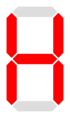
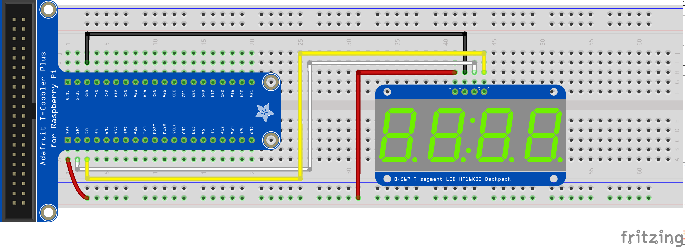

+++
draft = false
title = "Controlling a seven-segment display from the Raspberry Pi - Part 2"
Weight = 9
+++

## Custom characters

You can create your own character output on a per-segment basis.  Each character is simply an 8-bit binary number, or two hexadecimal digits.  The table below describes the hexadecimal and binary codes for each segment:

| Character | Hexidecimal | Binary |
| --------- | ----------- | ------ |
| {{}} | `0x01` | `0000 0001` |
| {{}} | `0x02` | `0000 0010` |
| {{}} | `0x04` | `0000 0100` |
| {{}} | `0x08` | `0000 1000` |
| {{}} | `0x10` | `0001 0000` |
| {{}} | `0x20` | `0010 0000` |
| {{}} | `0x40` | `0100 0000` |
| Decimal point | `0x80` | `1000 0000` |

For example, to generate a capital H:

| Character | Hexidecimal | Binary |
| --------- | ----------- | ------ |
| {{}} | `0x10 (bottom left)` `0x20 (top left)` `0x40 (centre)` `0x02 (top right)` `0x04 (bottom right)` `===================` `0x76` | `0001 0000 (bottom left)` `0010 0000 (top left)` `0100 0000 (centre)` `0000 0010 (top right)` `0000 0100 (bottom right)` `========================` `0111 0110`

## Circuit

Let's connect the seven segment display along with a momentary button, as in the following diagram:

{{}}


In this example, the circuit has been designed to use the pull-up resistors in the Raspberry Pi's GPIO pins.  Be sure to configure the GPIO inputs as GPIO.PUD_UP in your program.


## Exercise #1

Write a program that uses the button to increment the count displayed on the seven segment display.  The counter will increase if the button is depressed, and remain the same otherwise.

## Exercise #2

Now, we are going to write a program inspired by the reaction tester at the Ontario Science Centre.  The tester is similar in appearance to the driver's seat of a vehicle.  The simulation starts when the user presses the accelerator pedal.  At a random time, a STOP indicator is shown. When the user sees the STOP indicator, they are supposed to hit the brake pedal.  The tester then shows you a comparative view of your reaction time.

Write a program that displays 'go' to simulate acceleration.  It will then delay for a random amount of time (between 2 seconds and 5 seconds in duration), before displaying 'stop'.  To generate a random number and sleep for that amount of time (in seconds):


import time
import random

delay = random.randrange(2000, 5000) / 1000.0
time.sleep(delay)


Once stop is displayed, record the time and start polling the button input (GPIO #17).  Then the button is pressed, record the time again.  Use the following code as a template:


import datetime

startTime = datetime.datetime.now()

# ... do something ...

endTime = datetime.datetime.now()

elapsed = endTime - startTime
elapsedSeconds = elapsed.total_seconds()


Display the user's reaction time using the seven segment display.


There is a built-in function to display 4-char string. To call the function, use display.print("STOP")

